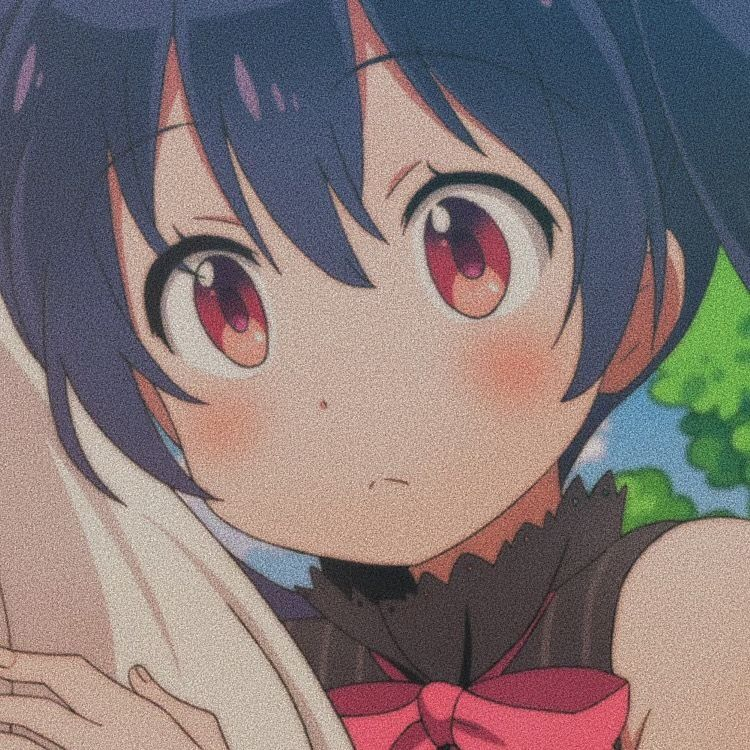
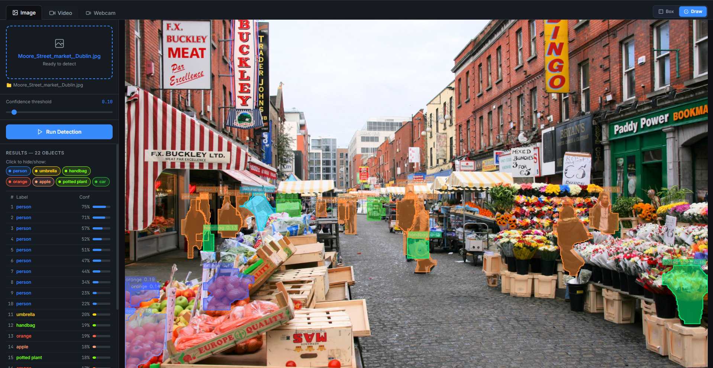
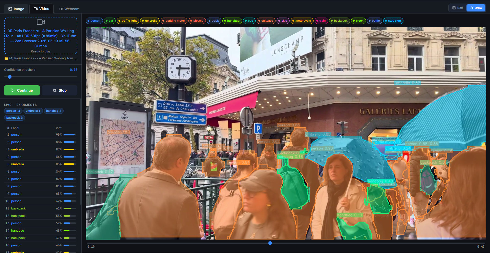

<p align="center">
  
</p>

<h1 align="center">YOLOv8s Object Detector — Desktop App</h1>

<p align="center">
  A desktop application built with <strong>Electron + Tailwind CSS</strong> that uses <strong>YOLOv8s</strong> to detect objects in images, videos, and live webcam feeds.
</p>

---

## App Preview

<p align="center">
  
  
</p>

This repository includes the example screenshots above from `png/image_examble.png` and `png/video_examble.png` showing how the app looks during image and video detection.

---

## Features

- **Image tab** — drag & drop or browse an image, run detection, click label tags to hide/show specific object classes
- **Video tab** — drag & drop a video file, play/pause/continue, seek to any position, real-time annotated frames
- **Webcam tab** — live detection from any connected camera
- **Box mode** — classic bounding boxes with confidence scores
- **Draw mode** — segmentation masks (filled polygons, 50% transparent) using `yolov8s-seg.pt`
- **Live controls** — confidence slider and Box/Draw toggle update in real-time without restarting
- **Label filter** — click label tags to hide/show specific classes on the output

---

## Requirements

| Requirement | Version |
|---|---|
| Python | **3.11** (recommended) |
| Node.js | **18+** |
| npm | **9+** |

> Python 3.14 is **not** supported — `ultralytics` requires Python ≤ 3.12.

---

## Setup

### 1. Clone the repository

```bash
git clone https://github.com/AXtremeTS/Object_detection_YOLOv8.git
cd Object_detection_YOLOv8
```

### 2. Install Python dependencies

```bash
pip install -r requirements.txt
```

This installs `ultralytics`, `opencv-python`, `numpy`, and `pillow`.

### 3. Model weights (auto-downloaded)

**You don't need to download anything manually.**

When the app runs for the first time, `ultralytics` will automatically download the model weights:

| File | Size | When |
|---|---|---|
| `yolov8s.pt` | ~22 MB | On first launch |
| `yolov8s-seg.pt` | ~25 MB | First time you use **Draw mode** |

The files are saved to the project root. After the first run they are cached and no download happens again.

> If you're on a slow connection or offline, you can manually download them from the [Ultralytics releases page](https://github.com/ultralytics/assets/releases) and place them in the project root.

### 4. Install Electron dependencies

```bash
cd electron_app
npm install
cd ..
```

---

## Running the App

### Option A — Double-click (Windows)

Double-click **`launch.bat`** in the project root.

### Option B — Terminal

```bash
cd electron_app
npm start
```

### First launch — Python setup wizard

On the very first run the app will show a **Python Setup** window instead of jumping straight in.

It automatically scans your machine for all Python installations and lists them with their version and whether `ultralytics` is installed. Versions that have `ultralytics` are sorted to the top and pre-selected.

1. Pick the Python you want to use from the list, **or** click **Browse…** to locate it manually
2. Click **Confirm & Launch**

The choice is saved to `python_config.json` and the setup window never appears again. To reset it (e.g. after installing a new Python), just delete `python_config.json`.

---

## Project Structure

```
Object_detection_YOLOv8/
├── electron_app/
│   ├── main.js               # Electron main process
│   ├── preload.js            # Secure IPC bridge
│   ├── package.json
│   └── renderer/
│       ├── index.html        # Main UI (3 tabs)
│       ├── style.css         # Tailwind + custom styles
│       ├── app.js            # Main UI logic
│       ├── setup.html        # Python setup wizard
│       └── setup.js          # Setup wizard logic
├── png/                      # Sample test images
├── ui_backend.py             # Python detection backend
├── yolov8s_image_detect.py   # Standalone image detection script
├── yolov8s_video_detect.py   # Standalone video detection script
├── yolov8s_webcam_detect.py  # Standalone webcam detection script
├── requirements.txt
├── build.bat                 # Builds standalone installer
├── launch.bat                # One-click dev launcher (Windows)
└── README.md
```

---

## Standalone Scripts

The three original detection scripts still work independently without the UI:

```bash
# Image
python yolov8s_image_detect.py --image png/duong_pho_tphcm.jpg --conf 0.4 --save

# Video
python yolov8s_video_detect.py

# Webcam
python yolov8s_webcam_detect.py
```

---

## Building a Standalone Installer (Windows)

This produces a single `.exe` installer that users can run with **no Python, no Node.js, nothing else required**. The installer bundles everything — Electron, Chromium, and the full Python runtime with all dependencies.

> **Expected output size: ~2–3 GB** (PyTorch is large)

### Prerequisites

Complete the Setup steps above first (Python deps + npm install).

### Run the build

Double-click **`build.bat`** or run from terminal:

```bash
build.bat
```

It runs 4 steps automatically:

| Step | What it does |
|---|---|
| 1 | Checks / installs PyInstaller |
| 2 | Bundles `ui_backend.py` + Python + all deps → `pyinstaller_dist/ui_backend/` |
| 3 | Installs Electron npm dependencies |
| 4 | Packages Electron + bundled Python backend → `dist/` |

### Output

```
dist/
└── YOLOv8s Detector Setup 1.0.0.exe   ← send this to anyone
```

### Notes

- Build must be run on **Windows x64**
- The model `.pt` files must be present in the project root before building — run the app in dev mode once first so they auto-download, then build
- Build time is ~5–10 minutes

---

## How It Works

```
Electron renderer (HTML/JS)
        │  JSON over stdin/stdout
        ▼
  ui_backend.py  (Python)
        │
        ├── Box mode  →  yolov8s.pt     (detection)
        └── Draw mode →  yolov8s-seg.pt (segmentation)
```

Electron spawns `ui_backend.py` as a child process. The renderer sends JSON commands (`detect_image`, `start_video`, `start_webcam`, `set_params`, etc.) and the backend streams annotated frames back as base64 JPEG.

---

## Troubleshooting

**Setup wizard shows no Python installations**  
→ Click **Browse…** and navigate to your `python.exe` manually.

**App opens but "Connecting…" never changes to "Model ready"**  
→ Delete `python_config.json` to re-run the setup wizard and pick a Python that has `ultralytics` installed.

**`ModuleNotFoundError: No module named 'ultralytics'`**  
→ Run `pip install -r requirements.txt` using the Python you selected in the setup wizard.

**Draw mode is slow on first use**  
→ It downloads `yolov8s-seg.pt` (~25 MB) on first run. Subsequent uses are fast.

**Webcam not opening**  
→ Try camera index `1` or `2` if `0` doesn't work. Make sure no other app is using the camera.
